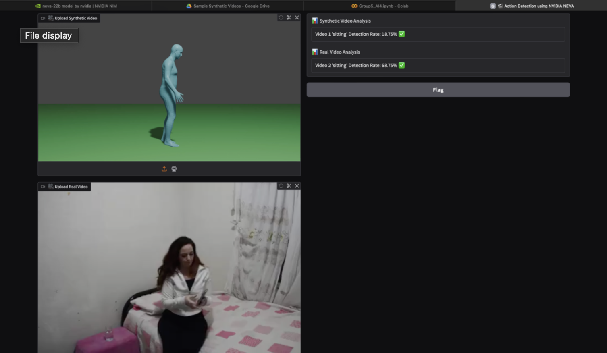
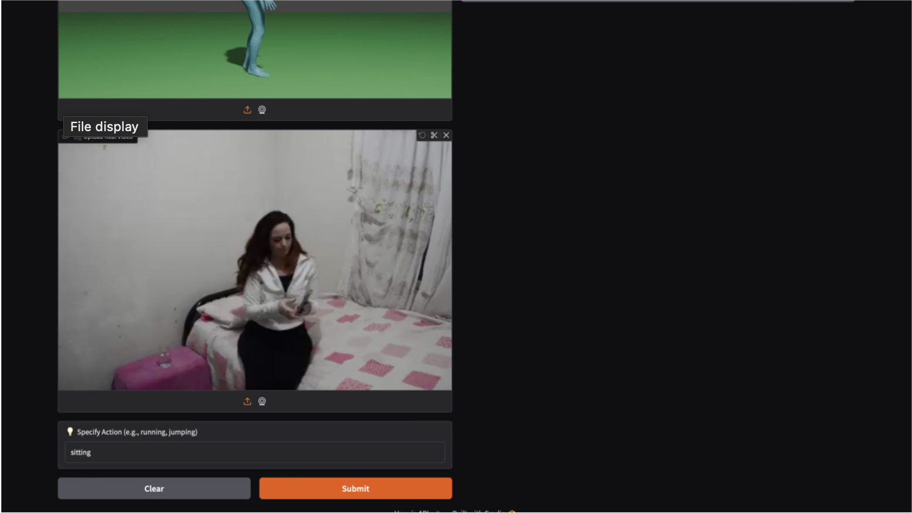

# NVIDIA_TRACK_2_Group_5_ARI146_ARI155_ARI167_ARI183
Human Action Detection using NVIDIA NEVA 22B

Demo Video - https://youtu.be/k-hCf09V0yc

# Problem Statement 
Human Action Recognition using NVIDIA VLM Workflow

# Models :
- [Neva-22b](https://ai.api.nvidia.com/v1/vlm/nvidia/neva-22b)
- [kosmos-2](https://ai.api.nvidia.com/v1/vlm/microsoft/kosmos-2)
- [fuyu-8b](https://ai.api.nvidia.com/v1/vlm/adept/fuyu-8b)
- [paligemma](https://ai.api.nvidia.com/v1/vlm/google/paligemma)
- [phi-3-vision](https://ai.api.nvidia.com/v1/vlm/microsoft/phi-3-vision-128k-instruct)

# Steps 
- Installation of Gradio
- Importing Libraries
- API Configuration
- Video frames
- Detecting actions using Models
- Calculating Accuracy (actions)
- Prototype Interface Using Gradio

# Interface Using Gradio

# Team Members
- [Varshini Vaddepalli](https://github.com/varshinivaddepalli)
- [Akhila Sripada](https://github.com/varshinivaddepalli)
- [Tanmayi Sri](https://github.com/varshinivaddepalli)
- [Sparsh Rathi](https://github.com/varshinivaddepalli)
